## Pet-Adoption-Service_T3A2-B

## **Table of Contents:** <!-- omit in toc -->
- [Pet-Adoption-Service\_T3A2-B](#pet-adoption-service_t3a2-b)
- [R10 - Website Application](#r10---website-application)
- [R11 - Github Repository](#r11---github-repository)
- [R12 - Part A Documentation](#r12---part-a-documentation)
- [**R13 - Screenshots of your Trello board throughout the duration of the project**](#r13---screenshots-of-your-trello-board-throughout-the-duration-of-the-project)
- [Testing](#testing)
- [Front-End](#front-end)
- [Testing](#testing-1)
- [Back-End](#back-end)

---

## R10 - Website Application
https://pet-adoption-servicefrontend-production-31ac.up.railway.app

## R11 - Github Repository
Final: https://github.com/Pet-Adoption-Service/Pet-Adoption-Service_T3A2-B

Front-End: https://github.com/Pet-Adoption-Service/Pet-Adoption-Service_FrontEnd

Back-End: https://github.com/Pet-Adoption-Service/Pet-Adoption-Service-BackEnd

## R12 - Part A Documentation
https://github.com/Pet-Adoption-Service/Pet-Adoption-Service_T3A2-A

## **R13 - Screenshots of your Trello board throughout the duration of the project**

The link to our Trello board is available [Here](https://trello.com/b/XB2z1h7g
)!

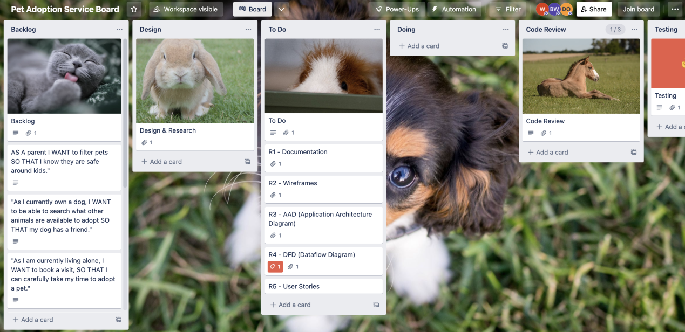

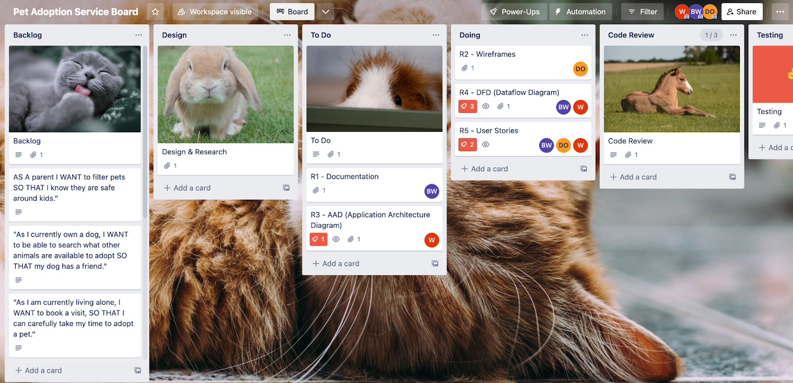
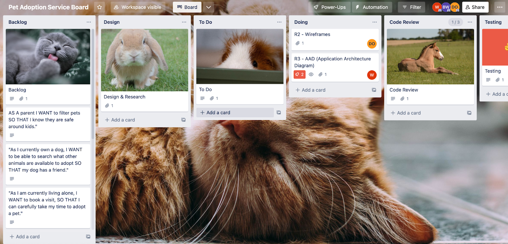
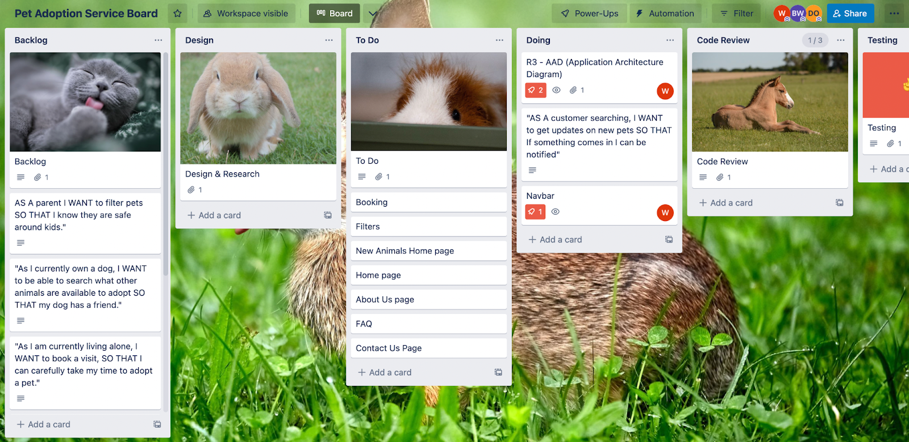

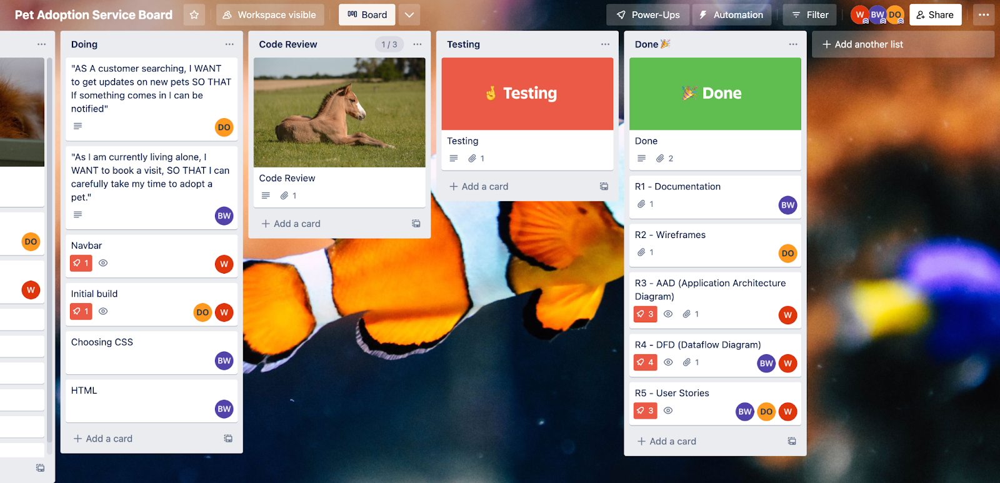
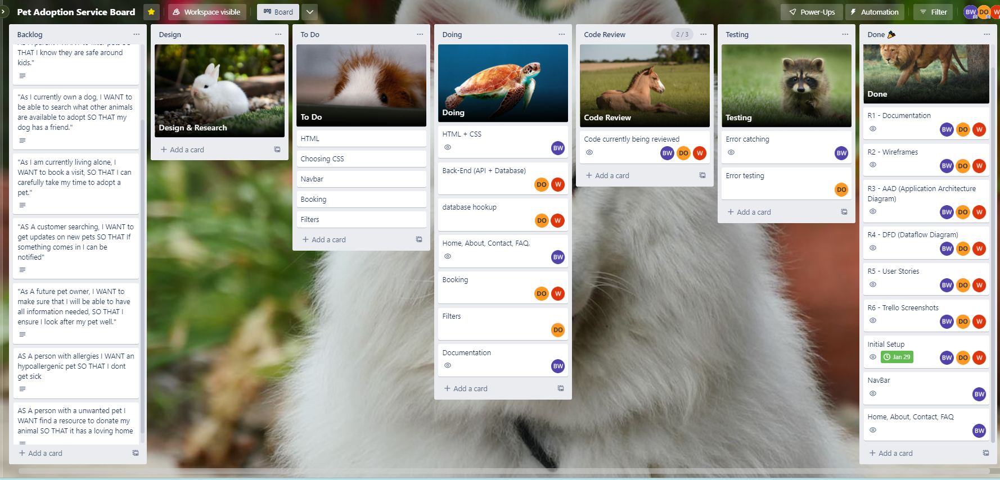
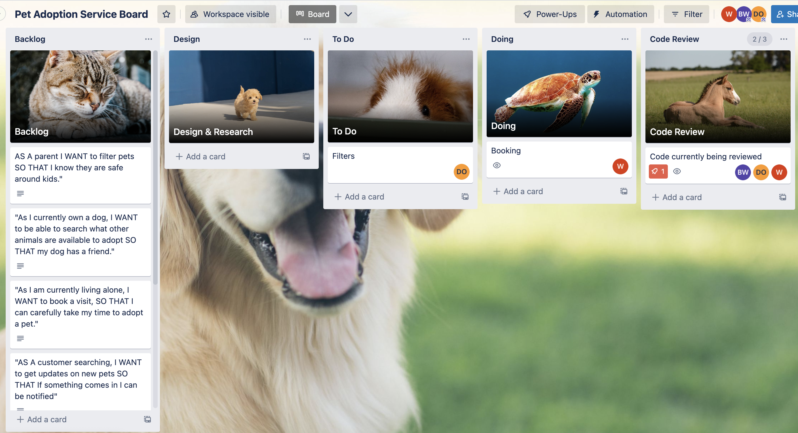
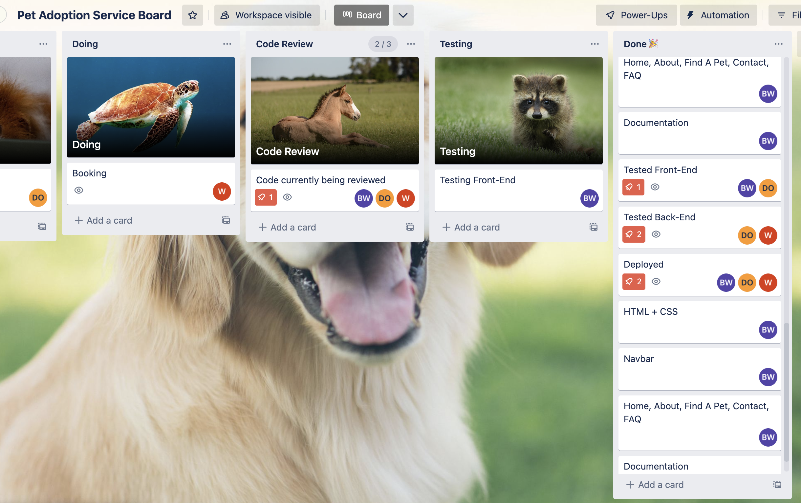

## Testing
## Front-End 
When going to an unknown domain
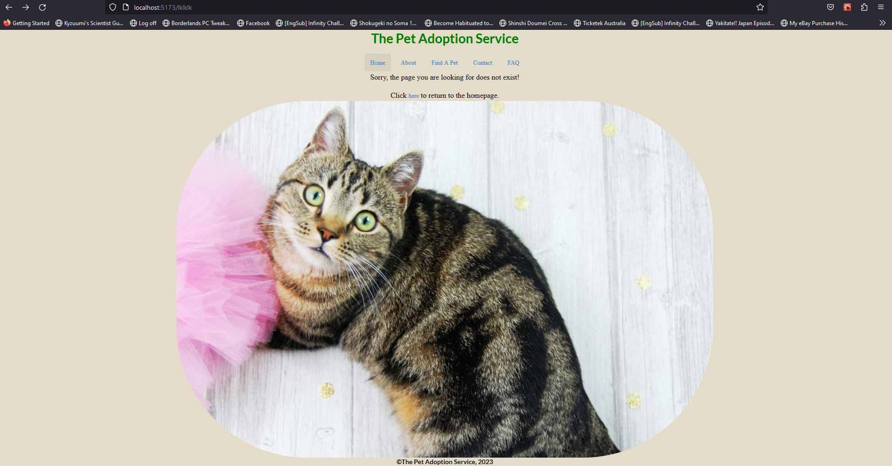

---

## Testing
## Back-End 
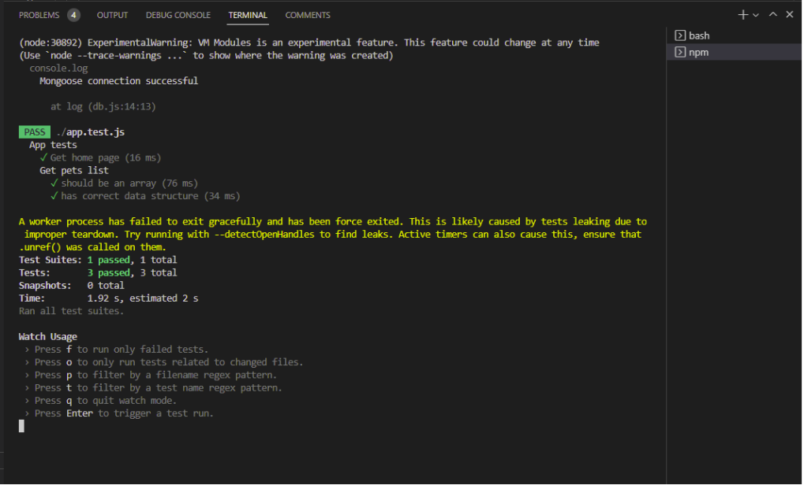
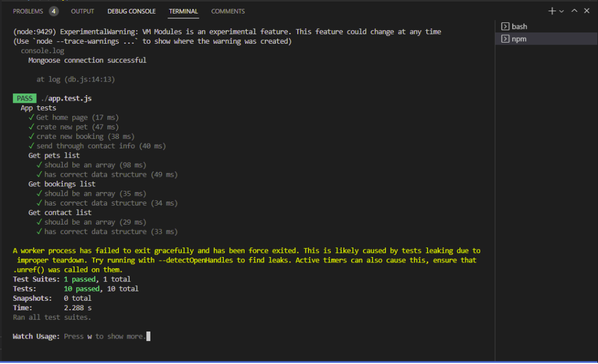
